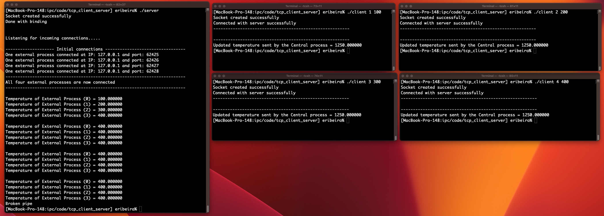

# tcp_client_server
Starter code example for tcp (socket) client-server system

#### Compilation instructions

```shell
csgcc utils.c tcp_server.c -o server
gcc -o client tcp_client.c utils.c
```

#### Here is a typical command line, run each in its own terminal

Open a terminal and run: 

```shell
./server
```

Open four terminals and in each one run: 

```shell
./client <external index> <initial temperature>
```

##### Example: 

```shell
./client 1 100
```

```shell
./client 2 200
```

```shell
./client 3 300
```

```shell
./client 4 400
```


