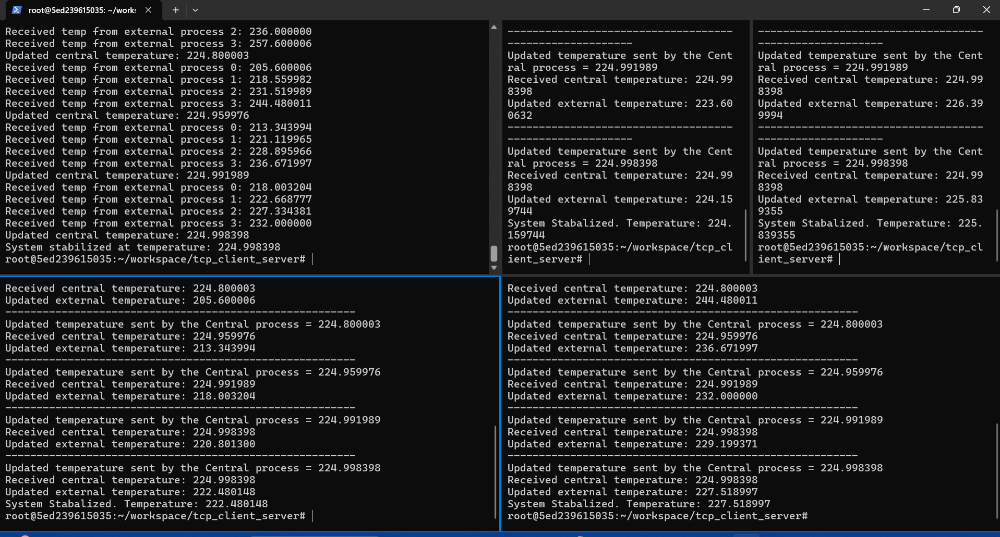
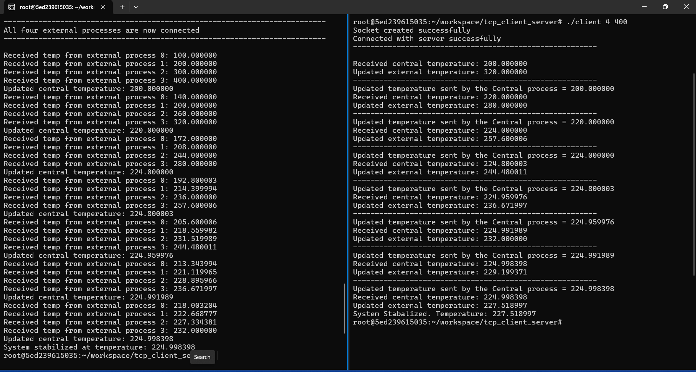
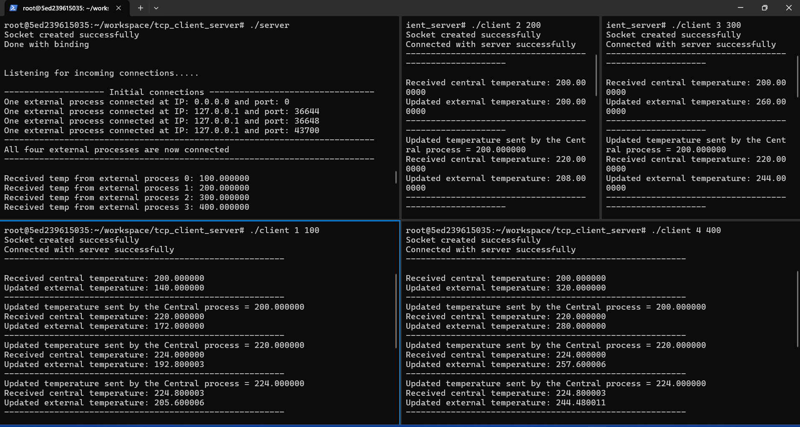

**How to run the code:**

2. Open a ternimal window
1. Exec the docker container - docker exec -it "directory_name" bash
3. Go into the tcp_ser_client directory
4. Execute the following commands:
    1. gcc utils.c tcp_server.c -o server
       gcc -o client tcp_client.c utils.c
    2. ./server
5. Open four other terminals and in each one run:
    1. ./client <external index> <initial temperature>
    2. _example_- ./client 1 100, ./client 2 200 ...
6. Incoming connections from each of the sockets created will stabalize at the same temperature, and
   once stabalized, the program will end
   
**Changes made to acomplish assignment:**
Files modified: tcp_server.c and tcp_client.c

tcp_client changes:
- added a loop, that will continuously send and recieve temeratures  untill the process temps are stable, recalculating the external temp
  based on the recieved central temp untill stable.
- added new calculation of temperature logic.

tcp_server changes
- added new calculation of temperature logic.
- loop that recalculates central temperature untill stable.
- added stabalization check; checks based on the temp threshhold, terminating once stable.

**Output - 3 views** just to see the whole code. It did not all fit on screen:

